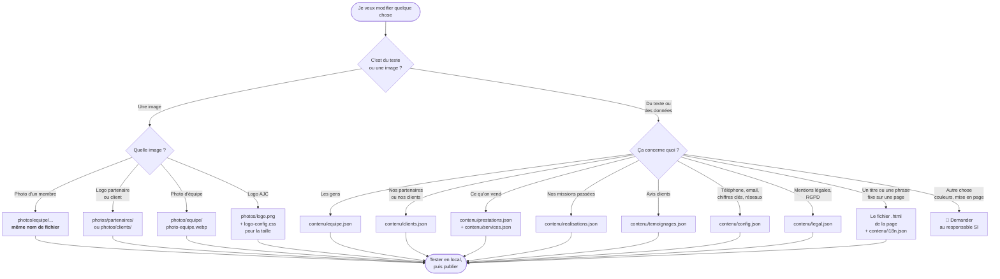
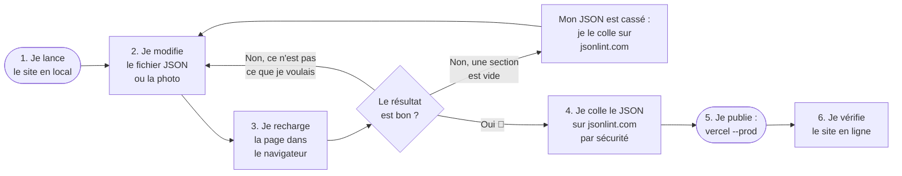
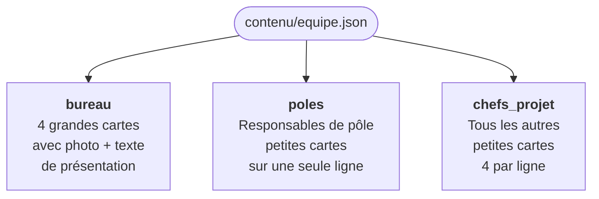
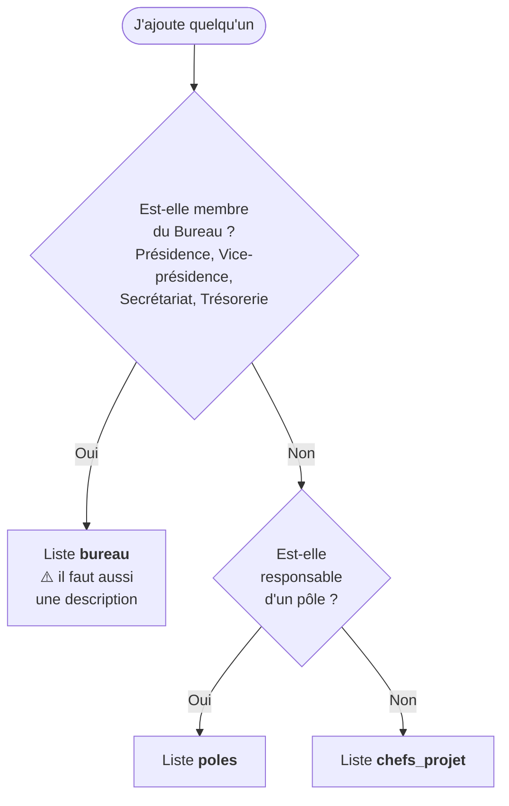
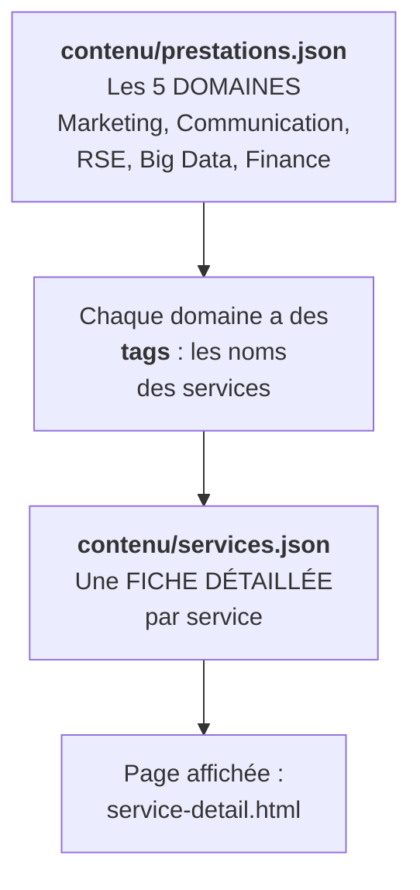
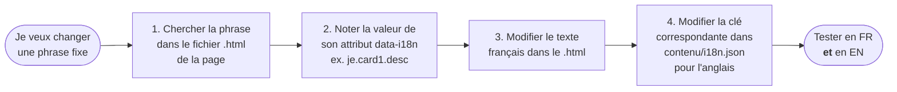
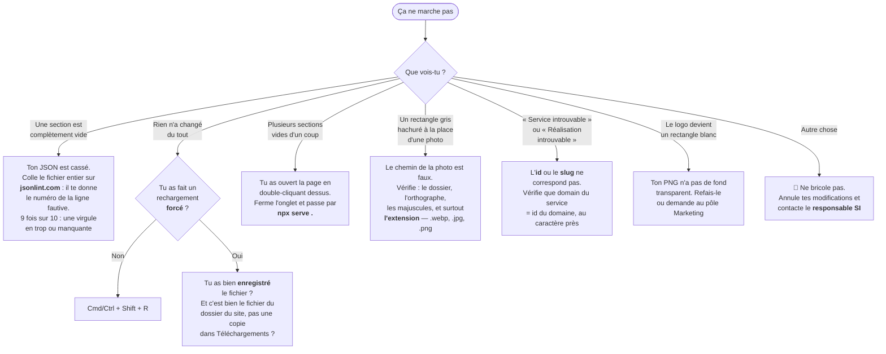

# Guide de modification du site AJC

> **Pour qui ?** Pour n'importe quel membre d'AJC, même sans aucune connaissance en informatique.
> Si tu sais utiliser un traitement de texte, tu sais modifier ce site.
>
> **Le principe en une phrase :** le site est comme un cahier à trous. Les textes et les
> photos sont rangés dans des fichiers séparés (`contenu/` et `photos/`) ; le site va les
> chercher tout seul. **Tu modifies le contenu, jamais le site.**

---

## Sommaire

1. [Les 4 règles d'or](#1-les-4-règles-dor)
2. [Logigramme maître : « je veux changer quoi ? »](#2-logigramme-maître--je-veux-changer-quoi-)
3. [Le JSON expliqué en 3 minutes](#3-le-json-expliqué-en-3-minutes)
4. [La boucle de travail : modifier → tester → publier](#4-la-boucle-de-travail--modifier--tester--publier)
5. [Les recettes](#5-les-recettes)
   - [5.1 Partenaires](#51-partenaires)
   - [5.2 Clients](#52-clients)
   - [5.3 L'équipe](#53-léquipe)
   - [5.4 Prestations et services](#54-prestations-et-services)
   - [5.5 Réalisations](#55-réalisations)
   - [5.6 Témoignages](#56-témoignages)
   - [5.7 Chiffres clés](#57-chiffres-clés)
   - [5.8 Téléphone, email, réseaux sociaux](#58-téléphone-email-réseaux-sociaux)
   - [5.9 Mentions légales et confidentialité](#59-mentions-légales-et-confidentialité)
   - [5.10 Le logo](#510-le-logo)
   - [5.11 Les textes fixes des pages](#511-les-textes-fixes-des-pages)
   - [5.12 La version anglaise](#512-la-version-anglaise)
6. [Publier en ligne](#6-publier-en-ligne)
7. [Ça ne marche pas : le logigramme de dépannage](#7-ça-ne-marche-pas--le-logigramme-de-dépannage)
8. [Antisèche : quel fichier pour quoi](#8-antisèche--quel-fichier-pour-quoi)

---

## 1. Les 4 règles d'or

| # | Règle | Pourquoi |
|---|---|---|
| 1 | **Je ne touche qu'aux fichiers de `contenu/` et aux images de `photos/`** | Les fichiers `.html`, `.css`, `.js` contiennent la mécanique du site. Y toucher sans savoir, c'est casser une page entière. |
| 2 | **Je ne pars jamais d'une page blanche : je copie un bloc qui existe déjà, puis je remplace le texte** | 90 % des erreurs viennent d'un bloc écrit à la main. Copier-coller, c'est zéro risque. |
| 3 | **Je teste en local avant de publier** | Voir la commande au [§4](#4-la-boucle-de-travail--modifier--tester--publier). Ça prend 20 secondes et ça évite de mettre une page cassée en ligne. |
| 4 | **Avant de publier, je colle mon fichier sur [jsonlint.com](https://jsonlint.com)** | Il te dit en un clic si une virgule manque. Un JSON cassé = une section du site qui disparaît. |

> ⚠️ **La règle 4 est la plus importante.** Un JSON cassé ne fait pas apparaître de message
> d'erreur au visiteur : la section devient simplement **vide**. Personne ne le voit
> jusqu'à ce qu'un client s'en plaigne.

---

## 2. Logigramme maître : « je veux changer quoi ? »

C'est le seul schéma à retenir. Tu part de la case du haut, tu suis les flèches.



---

## 3. Le JSON expliqué en 3 minutes

Tous les fichiers de `contenu/` sont des **JSON**. Ce n'est pas du code : c'est une **fiche
d'identité en texte**. Il y a exactement 4 symboles à connaître.

### Les 4 symboles

| Symbole | Nom | À quoi ça sert | Image mentale |
|---|---|---|---|
| `{ }` | un **objet** | Décrit **une seule chose** (un membre, un partenaire) | Une **carte d'identité** |
| `[ ]` | une **liste** | Contient **plusieurs choses** du même type | Un **classeur** de cartes d'identité |
| `"..."` | du **texte** | Toute valeur écrite se met entre guillemets | Le texte écrit sur la carte |
| `,` | la **virgule** | Sépare deux éléments | Le trait entre deux lignes |

### Un exemple à lire à voix haute

```json
{
  "nom": "Audencia",
  "logo": "photos/partenaires/audencia.png",
  "lien": "https://www.audencia.com"
}
```

Ça se lit : « *Voici UNE chose (`{`). Son nom est « Audencia ». Son logo se trouve à cet
endroit. Son lien est cette adresse. Fin de la chose (`}`).* »

### La seule règle qui casse tout : la virgule finale

Dans une liste, on met une virgule **entre** les éléments, mais **jamais après le dernier**.

```json
"partenaires": [
  { "nom": "Audencia" },   ← virgule : il y a quelque chose après
  { "nom": "PwC" },        ← virgule : il y a quelque chose après
  { "nom": "LCL" }         ← PAS de virgule : c'est le dernier
]
```

> 💡 **Le réflexe qui sauve :** quand tu supprimes le **dernier** élément d'une liste,
> pense à enlever la virgule de celui qui devient le nouveau dernier.

### Les caractères spéciaux

Si ton texte contient lui-même un guillemet, il faut le « protéger » avec un anti-slash :

```json
"description": "Il a dit \"bonjour\" en arrivant."
```

Les apostrophes françaises (`'`) et les accents ne posent **aucun** problème : écris
normalement.

---

## 4. La boucle de travail : modifier → tester → publier



### Étape 1 — lancer le site sur ton ordinateur

Ouvre le **Terminal**, va dans le dossier du site, et lance :

```bash
npx serve .
```

Le terminal affiche une adresse du type `http://localhost:3000`. Ouvre-la dans ton
navigateur : c'est le site, avec tes modifications, visible par toi seul.

> 🛑 **Ne double-clique JAMAIS sur un fichier `.html` pour l'ouvrir.**
> Ça ouvre une adresse qui commence par `file://`, et dans ce mode le navigateur
> **refuse** de charger les fichiers de `contenu/`. Résultat : un site à moitié vide, et
> tu vas croire que tu as tout cassé alors que tout va bien. Il **faut** passer par
> `npx serve .`.

### Étape 3 — recharger

Un simple F5 ne suffit pas toujours : le navigateur garde les anciens fichiers en mémoire.
Fais un **rechargement forcé** :

- Mac : `Cmd` + `Shift` + `R`
- Windows : `Ctrl` + `Shift` + `R`

---

## 5. Les recettes

### 5.1 Partenaires

📄 Fichier : **`contenu/clients.json`**, liste `"partenaires"`
🖼️ Logos : **`photos/partenaires/`**
👀 Où ça s'affiche : bandeau défilant « NOS PARTENAIRES » en bas de la page d'accueil.
Le logo se retourne au survol de la souris pour laisser place à la description.

#### Ajouter un partenaire

**Étape 1 — préparer le logo.** Un fichier **PNG à fond transparent**, hauteur ~80 px,
nommé en minuscules sans accent ni espace (les espaces deviennent des tirets) :
`mon-partenaire.png`. Dépose-le dans `photos/partenaires/`.

**Étape 2 — ajouter la ligne.** Ouvre `contenu/clients.json`, trouve `"partenaires": [`,
et copie-colle un bloc existant juste en dessous. Voici celui d'Audencia comme modèle :

```json
{
  "nom": "Audencia",
  "logo": "photos/partenaires/audencia.png",
  "lien": "https://www.audencia.com",
  "description": "Le texte affiché au survol du logo. Explique en quoi ce partenaire nous aide.",
  "description_en": "The same text in English."
}
```

| Champ | Obligatoire ? | Explication |
|---|---|---|
| `nom` | ✅ | Nom affiché si le logo ne charge pas. Sert aussi de texte alternatif. |
| `logo` | ✅ | Le chemin **exact** vers le fichier, en partant de la racine du site. |
| `lien` | ✅ | L'adresse de leur site. Mets `"#"` si le partenaire n'a pas de site. |
| `description` | ➖ | Texte affiché au survol. Si tu l'omets, le logo ne se retourne pas. |
| `description_en` | ➖ | Traduction anglaise. Si tu l'omets, l'anglais affichera le texte français. |

**Étape 3 —** vérifie sur jsonlint.com, teste en local, publie.

#### Supprimer un partenaire

Supprime son bloc entier, de son `{` jusqu'à son `}` **et la virgule qui suit**.
Si c'était le dernier de la liste, enlève la virgule du nouveau dernier.
Le fichier logo dans `photos/partenaires/` peut rester : il ne gêne personne.

#### Modifier une description

Change juste le texte entre les guillemets de `"description"` (et `"description_en"`).

---

### 5.2 Clients

📄 Fichier : **`contenu/clients.json`**, liste `"clients"`
🖼️ Logos : **`photos/clients/`**
👀 Où : bandeau « ILS NOUS ONT FAIT CONFIANCE » sur la page d'accueil.

Même méthode que les partenaires, mais le bloc est **plus court** : il n'y a pas de
description.

```json
{ "nom": "Bagelstein", "logo": "photos/clients/bagelstein.png", "lien": "#" }
```

> ⚖️ **Rappel juridique important :** on n'affiche le logo d'un client que s'il nous a
> donné son accord écrit. En cas de doute, demande à la Présidence avant d'ajouter.

---

### 5.3 L'équipe

📄 Fichier : **`contenu/equipe.json`** — **un seul fichier pour toute l'équipe**
🖼️ Photos : **`photos/equipe/bureau/`** et **`photos/equipe/chefs-projet/`**
👀 Où : page **Notre Équipe** (`notre-equipe.html`)

Le fichier contient **3 listes**, qui correspondent aux 3 blocs de la page, dans l'ordre :



#### Où mettre la nouvelle personne ?



#### Ajouter un membre du bureau

Dans la liste `"bureau"`, copie un bloc existant et remplace :

```json
{
  "nom": "Prénom Nom",
  "role": "Présidente",
  "role_en": "President",
  "description": "Deux ou trois phrases qui expliquent son rôle concret pour le client.",
  "description_en": "The same two or three sentences in English.",
  "photo": "photos/equipe/bureau/president.webp",
  "linkedin": "https://www.linkedin.com/in/son-profil/"
}
```

#### Ajouter un responsable de pôle ou un chef de projet

Dans `"poles"` ou `"chefs_projet"` — le bloc est plus court, la description est optionnelle :

```json
{
  "nom": "Prénom Nom",
  "role": "Responsable Marketing",
  "role_en": "Head of Marketing",
  "photo": "photos/equipe/chefs-projet/cdp-14.webp",
  "linkedin": "https://www.linkedin.com/in/son-profil/"
}
```

| Champ | Obligatoire ? | Explication |
|---|---|---|
| `nom` | ✅ | Prénom + nom, comme on veut le lire sur le site. |
| `role` | ✅ | Le poste, en français. |
| `role_en` | ➖ | Le poste en anglais. Si absent, l'anglais affiche le français. |
| `description` | ✅ bureau / ➖ autres | Uniquement affiché pour le bureau. |
| `photo` | ✅ | Chemin exact du fichier. |
| `linkedin` | ✅ | L'URL complète du profil. Mets `"#"` si la personne n'en a pas. |

#### Supprimer un membre

1. Trouve son bloc grâce à son `"nom"`.
2. Supprime tout, de son `{` jusqu'à son `}` inclus, **plus la virgule qui suit**.
3. Si c'était le dernier de sa liste, enlève la virgule du nouveau dernier.
4. Sa photo dans `photos/` peut rester, elle ne s'affichera plus.

#### Déplacer quelqu'un d'une liste à une autre

C'est un **couper-coller**, en 2 temps :

1. **Copie** son bloc entier (avec `{` et `}`).
2. **Colle-le** à l'endroit voulu dans la nouvelle liste — la position dans la liste
   détermine sa position à l'écran, de gauche à droite.
3. **Supprime** le bloc d'origine dans l'ancienne liste, virgule comprise.
4. Ajuste son `role` si son titre change.

> 📌 **Exemple réel :** pour placer Félix au **centre** des 5 responsables de pôle, son
> bloc a été mis en **3ᵉ position** de la liste `poles`, et supprimé de `chefs_projet`.
> 1ʳᵉ position = tout à gauche, dernière position = tout à droite.

#### Changer la photo d'un membre

Deux méthodes. **La première est de loin la plus sûre.**

**Méthode A — remplacer le fichier (recommandée)**
Renomme ta nouvelle photo avec **exactement** le nom du fichier existant
(ex. `resp-marketing.webp`) et écrase l'ancien dans le même dossier. **Rien à modifier
dans le JSON.**

**Méthode B — nouveau fichier**
Dépose ta photo avec un nouveau nom, puis mets à jour le champ `"photo"` du membre.
Attention : le chemin doit être **exact**, extension comprise.

**Format des photos de membres :** portrait, ratio **3:4** (ex. 600 × 800 px),
fond neutre, cadrage à hauteur des épaules. Les fichiers actuels sont en `.webp`
(plus léger), mais `.jpg` et `.png` fonctionnent aussi — pense juste à écrire la bonne
extension dans le JSON.

> Si une photo est absente ou mal nommée, le site n'affiche pas une image cassée :
> il met un rectangle gris hachuré avec le nom de la personne. C'est ton signal
> qu'il y a une faute de frappe dans le chemin.

#### Changer la photo d'équipe (le grand bandeau en haut de page)

Remplace le fichier `photos/equipe/photo-equipe.webp` (format paysage, min. 1600 px de
large). Son chemin est indiqué dans `contenu/config.json` → `pages.notre_equipe_photo`.

#### Changer le nombre « 24 chefs de projets »

Ce nombre est un **texte fixe**, il n'est pas calculé automatiquement. Il apparaît à
3 endroits qu'il faut modifier **ensemble** :

| Où | Quoi |
|---|---|
| `notre-equipe.html` | le gros chiffre `24` et la phrase « Notre équipe est composée de 24 chefs de projets… » |
| `notre-equipe.html` | le sous-titre du bandeau : « 24 chefs de projets passionnés… » |
| `contenu/i18n.json` | les clés `eq.hero.sub` et `eq.cdp.desc` pour la version anglaise |

C'est le seul cas de l'équipe qui touche à un fichier `.html` : demande de l'aide si tu
n'es pas sûr.

---

### 5.4 Prestations et services

C'est la partie la plus riche du site. Elle repose sur **deux niveaux** :



> 🔗 **Le lien entre les deux fichiers est l'`id`.** Un service de `services.json` est
> rattaché à son domaine par son champ `"domain"`, qui doit être **identique** à l'`id`
> du domaine dans `prestations.json`. Si les deux ne correspondent pas, la page affiche
> « Service introuvable ».

#### Modifier le texte d'un domaine

Dans `contenu/prestations.json`, trouve le domaine par son `"titre"` et modifie :

| Champ | Ce que ça change à l'écran |
|---|---|
| `titre` / `titre_en` | Le nom du domaine |
| `description` / `description_en` | Le paragraphe de présentation |
| `tags` / `tags_en` | Les boutons cliquables des services |
| `exemples` | Les cartes « Exemples de missions » (`client`, `contexte`, `livrable`) |
| `methodologie` | Les étapes de « Notre approche » |

#### Ajouter un service

C'est la seule opération en **deux fichiers**. Suis l'ordre.

**Étape 1 —** dans `contenu/prestations.json`, ajoute son nom dans les `tags` du bon
domaine (et dans `tags_en`, **à la même position**) :

```json
"tags": ["Étude de marché", "Segmentation client", "Mon nouveau service"],
"tags_en": ["Market research", "Customer segmentation", "My new service"]
```

**Étape 2 —** dans `contenu/services.json`, copie un bloc de service existant et remplis :

```json
{
  "id": "mon-nouveau-service",
  "domain": "marketing",
  "titre": "Mon nouveau service",
  "accroche": "Une phrase courte et percutante.",
  "description": "Un paragraphe qui explique ce qu'on fait et ce que le client y gagne.",
  "approche": [
    { "titre": "Cadrage",     "texte": "Ce qu'on fait à l'étape 1.", "titre_en": "Scoping",     "texte_en": "What we do in step 1." },
    { "titre": "Collecte",    "texte": "Ce qu'on fait à l'étape 2.", "titre_en": "Collection",  "texte_en": "What we do in step 2." },
    { "titre": "Analyse",     "texte": "Ce qu'on fait à l'étape 3.", "titre_en": "Analysis",    "texte_en": "What we do in step 3." },
    { "titre": "Restitution", "texte": "Ce qu'on fait à l'étape 4.", "titre_en": "Presentation","texte_en": "What we do in step 4." }
  ],
  "livrables": [
    { "titre": "Rapport d'étude", "texte": "Ce que le client reçoit.", "titre_en": "Study report", "texte_en": "What the client receives." }
  ],
  "titre_en": "My new service",
  "accroche_en": "A short, punchy sentence.",
  "description_en": "The same paragraph in English."
}
```

> ⚠️ **Comment fabriquer l'`id` :** prends le titre, tout en **minuscules**, enlève les
> **accents**, remplace chaque **espace par un tiret**, supprime la ponctuation.
> « Étude de marché » → `etude-de-marche`. « Business plan » → `business-plan`.

**`approche`** = les **phases de l'étude** affichées sur la fiche du service. C'est ici
qu'on précise nos méthodes et nos sources — par exemple notre accès aux bases de données
**Xerfi** et **Statista** :

```json
{ "titre": "Collecte",
  "texte": "Questionnaires, entretiens qualitatifs, observations terrain et recherche documentaire approfondie appuyée sur les bases de données de référence Xerfi et Statista." }
```

**`livrables`** = ce que le client repart avec, concrètement.

#### Supprimer un service

1. Enlève son nom des `tags` **et** des `tags_en` dans `prestations.json`.
2. Supprime son bloc dans `services.json`.

Si tu oublies l'étape 2, le bouton disparaît mais la fiche reste accessible par son
adresse directe. Si tu oublies l'étape 1, le bouton reste et mène à « Service introuvable ».

#### Ajouter un domaine entier

Rare (une fois par mandat au maximum). Dans `prestations.json`, copie un domaine complet
et remplis tous ses champs, puis ajoute au moins un service correspondant dans
`services.json` avec le bon `"domain"`. Le champ `"icone"` doit reprendre une valeur déjà
utilisée (`chart`, `megaphone`, `leaf`, `bars`, `shield`) : ce sont les seuls dessins qui
existent dans le site.

---

### 5.5 Réalisations

📄 Fichier : **`contenu/realisations.json`**
🖼️ Images : **`photos/realisations/`**
👀 Où : page **Nos Réalisations** + fiche détaillée `realisation-detail.html`

C'est le fichier **le plus long et le plus structuré** du site : une réalisation contient
son résumé, son étude de cas complète, ses résultats chiffrés et son témoignage.

📖 **Une documentation dédiée existe : lis `contenu/README-realisations.md` avant de
toucher à ce fichier.** La méthode reste la même : **duplique une réalisation existante**
et remplace son contenu champ par champ. Ne pars jamais de zéro.

Le champ `"slug"` joue le même rôle que l'`id` d'un service : c'est l'identifiant dans
l'adresse de la page. Mêmes règles (minuscules, sans accent, tirets).

---

### 5.6 Témoignages

📄 Fichier : **`contenu/temoignages.json`**
👀 Où : carrousel « Nos clients parlent de nous » sur la page d'accueil.

Le plus simple du site. Copie un bloc, remplace :

```json
{
  "quote": "La citation du client, telle qu'il l'a écrite.",
  "auteur": "Nom de l'entreprise",
  "mission": "Étude Marketing — Lancement produit",
  "quote_en": "The quote translated into English.",
  "mission_en": "Marketing Study — Product Launch"
}
```

> ⚖️ **On ne publie jamais un témoignage sans l'accord écrit du client.** Garde l'email
> d'accord dans le drive du pôle concerné.

---

### 5.7 Chiffres clés

📄 Fichier : **`contenu/config.json`** → `"chiffres_cles"`
👀 Où : les 4 grands nombres animés de la page d'accueil.

```json
"chiffres_cles": {
  "etudes_realisees": 28,
  "annees_experience": 45,
  "ans_iso_9001": 5,
  "etudiants_audencia": 6000
}
```

Écris les nombres **sans guillemets** (ce sont des chiffres, pas du texte) et **sans
espace ni symbole**. Le `+` après 6000 est ajouté automatiquement par le site.

---

### 5.8 Téléphone, email, réseaux sociaux

📄 Fichier : **`contenu/config.json`**

| Ce que tu veux changer | Le champ |
|---|---|
| L'email de contact | `association.email` |
| Le téléphone | `association.telephone` |
| L'adresse postale | `campus[0].adresse`, `code_postal`, `ville` |
| Le lien LinkedIn | `reseaux_sociaux[]` → l'objet dont `"nom"` est `"LinkedIn"` → `"lien"` |
| Le lien Instagram | idem avec `"Instagram"` |

Ces valeurs alimentent le pied de page **de toutes les pages** en même temps : une seule
modification suffit.

---

### 5.9 Mentions légales et confidentialité

📄 Fichier : **`contenu/legal.json`**
👀 Où : `mentions-legales.html` et `politique-confidentialite.html`

Deux grandes clés : `mentions_legales` et `politique_confidentialite`. Chacune contient
une liste `sections`, et chaque section ressemble à ça :

```json
{
  "titre": "1. Responsable du traitement",
  "paragraphes": ["Un premier paragraphe.", "Un deuxième paragraphe."],
  "liste": ["Une puce", "Une autre puce"],
  "paragraphes_apres": ["Un paragraphe qui vient après les puces."]
}
```

Seul `titre` est obligatoire. Le sommaire en haut de page se met à jour **tout seul**.
Pense à mettre à jour le champ `derniere_maj` (ex. `"Août 2026"`).

Pour mettre un lien dans un paragraphe, tu peux écrire du HTML, mais les guillemets
doivent être protégés par des anti-slashs :

```json
"paragraphes": ["Écris-nous à <a href=\"mailto:contact@ajc-mail.com\">contact@ajc-mail.com</a>."]
```

---

### 5.10 Le logo

**Changer l'image :** remplace `photos/logo.png` — **même nom, même dossier**. Il doit
être en **PNG à fond transparent**, sinon un rectangle blanc apparaîtra sur les fonds
sombres. Il s'applique automatiquement au bandeau de toutes les pages et à l'icône de
l'onglet du navigateur.

L'ancien logo est conservé dans `photos/logo-original.png` au cas où.

**Changer la taille :** ouvre **`logo-config.css`** à la racine et modifie **une seule
valeur** :

```css
:root {
  --logo-height: 40px;   /* 32px = discret · 40px = normal · 48px = grand */
}
```

C'est la seule exception à la règle d'or n°1 : ce fichier CSS ne contient que ce réglage,
tu ne peux rien casser d'autre.

---

### 5.11 Les textes fixes des pages

Certains textes ne sont pas dans `contenu/` : les grands titres, les slogans, les cartes
d'argumentaire. Ils sont écrits directement dans le fichier `.html` de la page, repérables
par l'attribut `data-i18n` :

```html
<div class="je-card-title" data-i18n="je.card1.title">Expertise académique</div>
<div class="je-card-desc"  data-i18n="je.card1.desc">Nos étudiants-consultants mobilisent…</div>
```

Pour modifier un texte comme celui-ci, il faut le changer **à deux endroits** :



> 🛑 **Ne modifie que le texte entre `>` et `<`.** Ne touche jamais aux `<balises>`,
> aux `class="..."` ni aux `data-i18n="..."`. Si tu supprimes une balise, la mise en page
> de la section s'effondre. En cas de doute : demande.

---

### 5.12 La version anglaise

Le site est bilingue. Le bouton **FR | EN** en haut à droite bascule tout.

Il y a **deux mécanismes**, selon l'origine du texte :

| Origine du texte | Comment on le traduit |
|---|---|
| Un fichier de `contenu/` (équipe, partenaires, services…) | On ajoute un champ **jumeau suffixé `_en`** à côté du champ français : `role` → `role_en`, `description` → `description_en` |
| Un texte fixe d'une page `.html` | On modifie la **clé correspondante** dans `contenu/i18n.json` |

**La règle de secours :** si un champ `_en` est absent ou vide, le site affiche
**le français**. Rien ne casse — le visiteur anglophone voit juste une phrase en
français. Tu peux donc ajouter du contenu en français d'abord et traduire plus tard.

---

## 6. Publier en ligne

Le site est hébergé sur **Vercel**. Une fois tes modifications testées en local :

```bash
vercel --prod
```

En moins d'une minute, le site public est à jour. Vérifie ensuite **en ligne** avec un
rechargement forcé (`Cmd`/`Ctrl` + `Shift` + `R`).

> 📌 Le déploiement se fait bien avec cette commande, **pas** par un simple push GitHub.

**Checklist avant de publier :**

- [ ] Mon JSON est validé sur jsonlint.com
- [ ] J'ai testé la page en local, la section s'affiche bien
- [ ] J'ai testé en **anglais** aussi (bouton EN)
- [ ] J'ai vérifié sur **mobile** (dans le navigateur : clic droit → Inspecter → icône téléphone).
      La majorité de nos visiteurs sont sur téléphone.
- [ ] J'ai relu l'**orthographe** : c'est la vitrine commerciale de la Junior

---

## 7. Ça ne marche pas : le logigramme de dépannage



### Le bouton « annuler tout » : Git

Si tu as fait n'importe quoi et que tu veux revenir à l'état d'avant tes modifications,
**sans avoir publié** :

```bash
git status
```

Cette commande liste les fichiers que tu as modifiés. Pour annuler les modifications d'un
seul fichier et revenir à la dernière version enregistrée :

```bash
git restore contenu/equipe.json
```

> 🛑 C'est **irréversible** : tout ce que tu as écrit dans ce fichier depuis le dernier
> enregistrement Git est perdu. Ne lance cette commande que si tu es sûr de vouloir
> repartir de zéro sur ce fichier.

---

## 8. Antisèche : quel fichier pour quoi

### Les fichiers de contenu

| Fichier | Ce qu'il contient | Où ça s'affiche |
|---|---|---|
| `contenu/config.json` | Email, téléphone, adresse, réseaux sociaux, chiffres clés | Pied de page de toutes les pages + accueil |
| `contenu/equipe.json` | Bureau, responsables de pôle, chefs de projet | `notre-equipe.html` |
| `contenu/clients.json` | Logos clients + logos et descriptions partenaires | Accueil, bas de page |
| `contenu/prestations.json` | Les 5 domaines et leurs services | `prestations.html` |
| `contenu/services.json` | La fiche détaillée de chaque service | `service-detail.html` |
| `contenu/realisations.json` | Les études de cas | `realisations.html`, `realisation-detail.html` |
| `contenu/temoignages.json` | Les avis clients du carrousel | Accueil |
| `contenu/legal.json` | Mentions légales et politique de confidentialité | Les 2 pages légales |
| `contenu/i18n.json` | Les traductions anglaises des textes fixes des pages | Toutes les pages, en mode EN |

### Les dossiers d'images

| Dossier | Contenu | Format conseillé |
|---|---|---|
| `photos/` | `logo.png` (fond transparent) | PNG transparent |
| `photos/equipe/bureau/` | Portraits du bureau et des responsables | Portrait 3:4, min 600 × 800 |
| `photos/equipe/chefs-projet/` | Portraits `cdp-01` … `cdp-13` | Portrait 3:4, min 300 × 400 |
| `photos/equipe/` | `photo-equipe.webp`, le bandeau de la page équipe | Paysage, min 1600 px de large |
| `photos/partenaires/` | Logos des partenaires | PNG transparent, ~80 px de haut |
| `photos/clients/` | Logos des clients | PNG transparent, ~80 px de haut |
| `photos/realisations/` | Visuels des études de cas | Voir `contenu/README-realisations.md` |
| `documents/` | La plaquette PDF téléchargeable | PDF |

### Les fichiers auxquels on ne touche pas

`index.html` et les autres `.html`, `style.css`, `assets/*.js`, `api/contact.js`,
`vercel.json`.

**Deux exceptions**, documentées plus haut :
- `logo-config.css` → la taille du logo ([§5.10](#510-le-logo))
- les textes `data-i18n` dans les `.html` → les phrases fixes ([§5.11](#511-les-textes-fixes-des-pages))

---

## En cas de doute

Écris au **responsable Systèmes d'Informations** du mandat avant de bricoler.
Une question de 30 secondes coûte moins cher qu'une page cassée en production.

> 📝 **Ce guide fait partie du site.** Si tu changes la structure d'un fichier de
> `contenu/`, mets ce document à jour dans la même foulée : le mandat suivant n'aura que
> ça pour comprendre.
